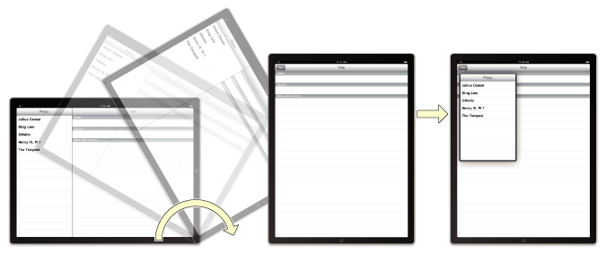

# CoderGirl-IOS
##Container Views, Custom Views and Gestures

*Taught by Amanda Rawls*

#### Demo app: Puppy Rating App
- two content view controllers - normal puppies, most favorite puppy
- Track information about puppies
- Use swipe gesture to browse puppies
- Use double tap to save as most favorite puppy and display
- Have root controller rating buttons in another container view (ibDesignable!)

#### Homework: A more sophisticated flash card app
- Use three content view controllers (front and back of card, report card)
- use swipe gesture to change flashcards
- Use double tap to show other side of flashcard
- Use IBDesignable and IBInspectable to style the container view to look like a card with rounded corners and drop shadow
- Include ability to remove cards from review
- Show a report when there are no more cards to review

Container Views
---
**Resources**

[developer.apple.com: container view](https://developer.apple.com/library/content/featuredarticles/ViewControllerPGforiPhoneOS/ImplementingaContainerViewController.html)

[developer.apple.com: view heirarchy](https://developer.apple.com/library/content/documentation/Cocoa/Conceptual/CocoaViewsGuide/WorkingWithAViewHierarchy/WorkingWithAViewHierarchy.html)

[developer.apple.com UIViewController: implementing a child view controller](https://developer.apple.com/documentation/uikit/uiviewcontroller)

**XCode Docs Text**
> Container View defines a region within a view controller's view subgraph that can include a child view controller. Create an embed segue from the container view to the child view controller in the storyboard.

**How does Apple use container views?**

Existing implementations of container views can be seen in UINavigationController, UITabBarController, and UISplitViewController. More details are found in the container view developer guide (see resources).




*Image credits: Apple Documentation*

**How does a container view fit into the hierarchy?**

- A normal view is a UIView, which can have a single superview and many children views. A container is a UIContainerView, which has a single parent view controller and can have many children view controllers.

**How could I use a container view?**

- Break down complex views into component parts with their own view controller
- Facilitate AutoLayout, especially when rotating the device
- Display multiple views in the same location of a view controller
- Design a view only once and display it from multiple views

**How do I add a container view?**

This is easily done through the storyboard (Interface Builder). In the Object library find container view, and drag it where it is wanted in the storyboard. It will automatically generate a view which is connected with an Embed segue.

**How do I add a child view to a container view?**

This can be done either through the storyboard through the embed segue for a static child view controller. When switching between child view controllers, we will have to change the visible child controller programatically using the following methods:
https://useyourloaf.com/blog/container-view-controllers/
```

addChildViewController(_:)

removeFromParentViewController()

willMove(toParentViewController:)

didMove(toParentViewController:)
```

When doing this programmatically it is important to follow a strict order of operation:
1. Establish a parent-child relationship to allow system messages to be propogated through the heirarchy
1. Add the child's root view to the view heirarchy
1. Add the child view controller to the parent view controller

When removing a child view controller, reverse the order of operation.

```
private func addContentController(_ child: UIViewController, to stackView: UIStackView) {
    addChildViewController(child)
    stackView.addArrangedSubview(child.view)
    child.didMove(toParentViewController: self)
}

private func removeContentController(_ child: UIViewController, from stackView: UIStackView) {
    child.willMove(toParentViewController: nil)
    stackView.removeArrangedSubview(child.view)
    child.view.removeFromSuperview()
    child.removeFromParentViewController()
}
```
*[code credit](https://useyourloaf.com/blog/container-view-controllers/)*

**How do I communicate between a child view controller and the parent view controller?**

Delegation, of course! In order to set the parent view controller as the delegate to the container view's child view controller, we need to override prepare(for:sender:) and identify which view controller is going to be loaded.

```
override func prepare(for segue: UIStoryboardSegue, sender: Any?) {

        switch segue.destination {
        case let viewController1 as ViewController1:
            self.viewController1 = viewController1
            viewController1.delegate = self
        case let viewController2 as ViewController2:
            self.viewController2 = viewController2
            viewController2.delegate = self
        default:
            break
        }
}
```
*[code credit](https://medium.com/@superpeteblaze/ios-swift-tip-getting-references-to-container-child-view-controllers-653fe58e6f5e)*

Custom Views
---
**Resources**

[developer.apple.com: live rendering](https://developer.apple.com/library/content/documentation/Swift/Conceptual/BuildingCocoaApps/WritingSwiftClassesWithObjective-CBehavior.html#//apple_ref/doc/uid/TP40014216-CH5-ID86)

[developer.apple.com: UIView subclassing notes; methods to override: initialization](https://developer.apple.com/documentation/uikit/uiview)

[developer.apple.com: computed properties (get/set)](https://developer.apple.com/library/content/documentation/Swift/Conceptual/Swift_Programming_Language/Properties.html)

**What do we mean by custom views?**

  A custom view is a UIView that has been subclassed in order to add functionality or other customizations not provided by UIKit.

  A UIView is not the only thing that you can subclass. Classes that themselves subclass UIView, provided they are not marked final, can also be subclassed in this way (ie: UIButton is subclassed from UIControl, which is a subclass of UIView.)

**How can I use custom views?**

There are two ways that an app can try to initialize a UIView:
1. from the storyboard's nib*
1. programmatically as defined by you

Because we have multiple ways to initialize a view we need multiple init methods to handle each one.
```
class customView: UIView {
      override init(frame: CGRect) {
        super.init(frame: frame)
        sharedInit()
    }

    required init?(coder aDecoder: NSCoder) {
        super.init(coder: aDecoder)
        sharedInit()
    }

    func sharedInit() {
        // initialization tasks
    }
}
```

*Xib vs Nib: [as explained by Yoseob Lee](https://www.prolificinteractive.com/2017/06/09/xib-awakening-uniform-way-load-xibs/)

> Xibs and nibs are pretty much the same thing; the real difference being their role in the overall process.

> Nibs, known as NeXT Interface Builder files, are actually compiled from xib files and act as a “bundle” that contain all of its relevant files. This is what old-school iOS developers had to work with, but, for most of us, you can think of nibs as the final product in the lifecycle of a custom view.

> Xibs, known as XML Interface Builder files, are what most of us are familiar with. Create a new user-interface file on Xcode and take a look at the extension — xib! Whenever you are working on a custom interface in Xcode, you are working in a xib. Xibs were introduced in Xcode 3.0 as a way of addressing the common issue of version control associated with nibs. Since nibs were actually bundles, it made version control much more difficult; hence xib files are essentially “flat” XML files (think about any Storyboard conflicts — those are also XML files) that provide more clarity on changes between versions.

**How do I see my custom views in the Storyboard?**

It's as easy as @IBDesignable
```
@IBDesignable class customView: UIView {
  // MARK: - init methods
}
```

**How do I edit my custom views from the Storyboard?**

It's as easy as @IBInspectable
```
@IBDesignable class customView: UIView {
  @IBInspectable var cornerRadius: CGFloat {
        get {
            return self.layer.cornerRadius
        }
        set(radius) {
            self.layer.cornerRadius = radius
        }
    }

    // MARK: - init methods
}
```

Gestures
---
**Resources**

[developer.apple.com Human Interface Guidelines: Gestures](https://developer.apple.com/ios/human-interface-guidelines/user-interaction/gestures/)

[developer.apple.com: gesture recognition](https://developer.apple.com/documentation/uikit/touches_presses_and_gestures/handling_uikit_gestures)

**What kind of gestures are there?**
- Tap
- Pinch
- Swipe
- Rotation
- Pan (Drag)
- Screen Edge Pan
- Long Press
- Custom

**How does Apple use gestures?**
From Apple:
> People generally expect the following standard gestures to work the same across the system and in every app.

- **Tap**: Activates a control or selects an item.
- **Double tap**: Zooms in and centers content or an image, or zooms out if already zoomed in.
- **Drag**: Moves an element from side-to-side or drags an element across the screen.
- **Swipe**: When performed with one finger, returns to the previous screen, reveals the hidden view in a split view controller, reveals the Delete button in a table-view row, or reveals actions in a peek. When performed with four fingers on an iPad, switches between apps.
- **Flick**: Scrolls or pans quickly.
- **Pinch**: Zooms in when pinching outward, zooms out when pinching inward.
- **Touch and hold**: When performed in editable or selectable text, displays a magnified view for cursor positioning. When performed in certain views, such as a collection view, enters a mode that allows items to be rearranged.
- **Shake**: Initiates undo or redo.

**How can I add and customize gestures?**

You can add gesture recognizers in the Storyboard or add gestures programmatically. UIKit provides gesture recognizers that we can use.

---

**Additional Resources**

[Ray Wenderlich: CALayers](https://www.raywenderlich.com/2502/calayers-tutorial-for-ios-introduction-to-calayers-tutorial)
